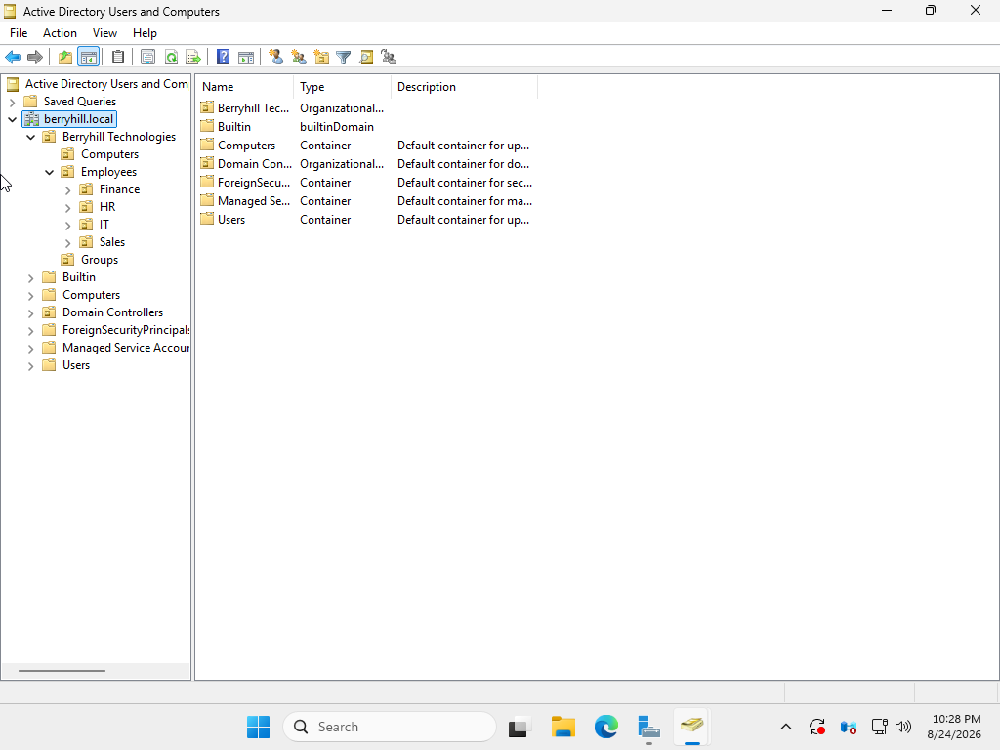
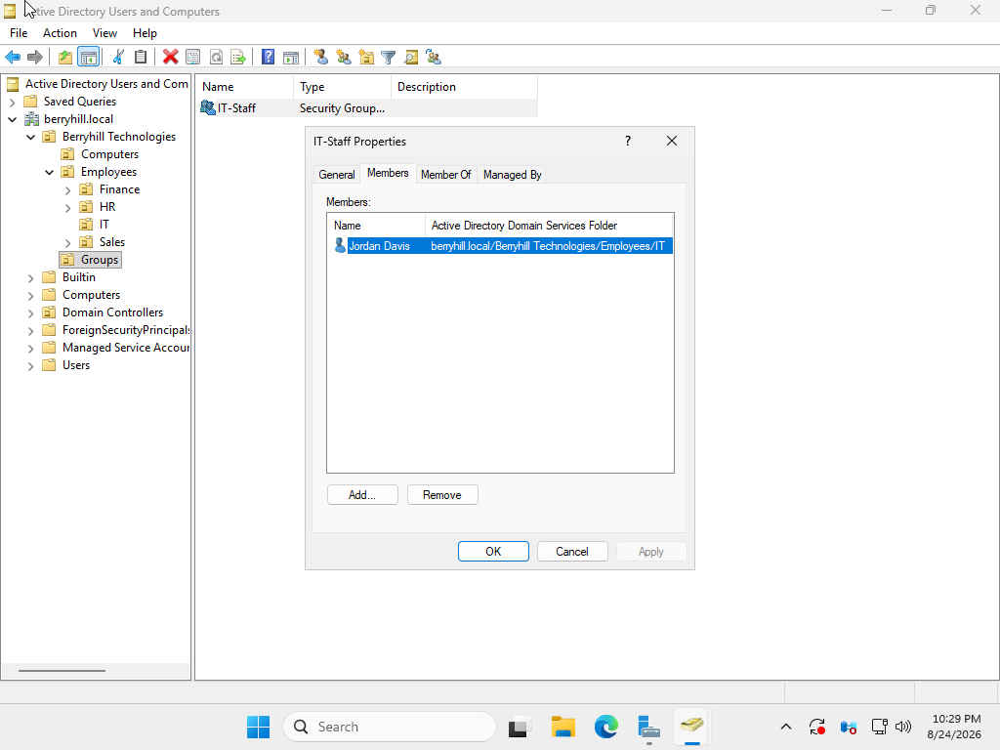
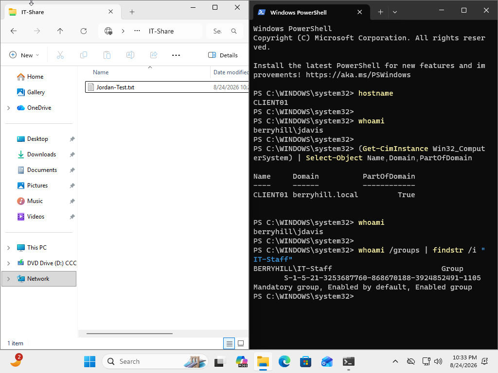
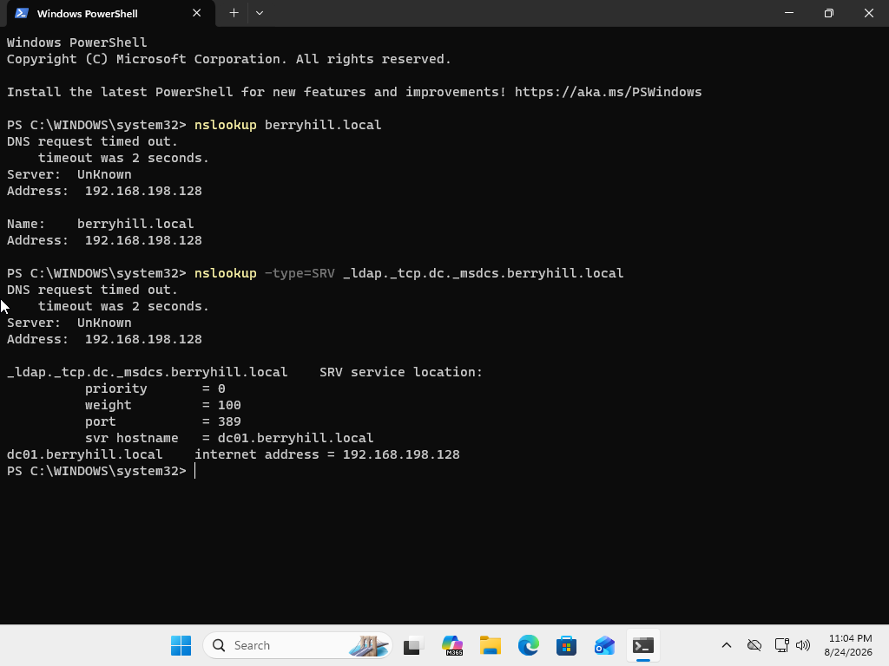

# Active Directory Help Desk Home Lab

## Project Overview

This project demonstrates the deployment and administration of a small Windows domain environment designed to simulate common IT Help Desk and Systems Administration responsibilities.

The lab was built using virtual machines and includes a Windows Server domain controller and a Windows 11 client workstation. The environment was used to practice Active Directory administration, DNS configuration, domain authentication, user and group management, password administration, SMB file sharing, NTFS permissions, and troubleshooting.

---

## Lab Environment

| System | Role |
|---|---|
| DC01 | Windows Server / Domain Controller |
| CLIENT01 | Windows 11 Domain-Joined Workstation |
| berryhill.local | Active Directory Domain |
| Active Directory Domain Services | Identity and authentication |
| DNS | Domain name resolution |
| PowerShell | Administration and troubleshooting |

---

## Active Directory Structure

I created an organizational structure representing a small business environment.

**Domain:** `berryhill.local`

**Organization:** `Berryhill Technologies`

Organizational Units (OUs) included:

- Computers
- Employees
  - Finance
  - HR
  - IT
  - Sales
- Groups

This structure allows users, computers, and security groups to be organized based on business function.

---

## User and Group Administration

Created a test employee account:

**User:** Jordan Davis  
**Username:** `jdavis`

The account was placed in the IT organizational unit.

I also created the following security group:

**Security Group:** `IT-Staff`

Jordan Davis was configured as a standard domain user to represent a typical employee account. Access to shared resources was later restricted using group-based permissions, with standard Domain Users receiving read-only access.

This follows the principle of group-based access control and simplifies permission administration as an organization grows.

---

## Domain-Joined Workstation

Configured a Windows 11 workstation named:

`CLIENT01`

The workstation was joined to:

`berryhill.local`

After joining the domain, I verified domain authentication by signing into CLIENT01 using the domain account:

`BERRYHILL\jdavis`

PowerShell was used to verify the workstation's domain membership and authenticated user context.

Example validation commands:

`hostname`

`whoami`

`(Get-CimInstance Win32_ComputerSystem) | Select-Object Name,Domain,PartOfDomain`

---

## DNS Configuration and Validation

CLIENT01 was configured to use the domain controller as its DNS server.

This allowed the workstation to locate Active Directory services and the domain controller.

DNS and Active Directory service discovery were validated using tools such as:

`ipconfig`

`nslookup berryhill.local`

`nslookup -type=SRV _ldap._tcp.dc._msdcs.berryhill.local`

The SRV lookup successfully identified `dc01.berryhill.local` as an LDAP service provider for the domain.

---

## SMB File Share and Permissions

Created a shared folder on DC01:

`C:\IT-Share`

The folder was published as an SMB network share:

`\\DC01\IT-Share`

Access was assigned to the `IT-Staff` security group rather than directly to Jordan Davis.

Share permissions were configured to allow the group to modify content.

NTFS permissions were also configured for `IT-Staff`.

This demonstrated the interaction between:

- Active Directory security groups
- SMB share permissions
- NTFS file system permissions
- Domain authentication

---

## Troubleshooting Scenario

During testing, the domain user initially received:

> Windows cannot access \\DC01\IT-Share

The workstation could successfully communicate with DC01 over TCP port 445, confirming that basic SMB network connectivity was functioning.

Troubleshooting included:

- Verifying TCP 445 connectivity
- Confirming SMB share configuration
- Reviewing share permissions
- Reviewing NTFS permissions
- Verifying Active Directory group membership
- Refreshing Group Policy
- Checking the user's authentication token
- Testing access from CLIENT01

Commands used during troubleshooting included:

`Test-NetConnection DC01 -Port 445`

`net use`

`whoami /groups`

`gpupdate /force`

`Get-ADGroupMember "IT-Staff"`

`Get-SmbShareAccess -Name "IT-Share"`

The issue was resolved by validating and correcting group membership and permissions.

---

## Final Validation

The completed configuration was tested from CLIENT01 while authenticated as:

`BERRYHILL\jdavis`

The following were successfully verified:

- CLIENT01 was joined to `berryhill.local`
- Jordan Davis could authenticate using the domain account
- The user was recognized as a standard domain user with read-only access to shared resources
- CLIENT01 could communicate with DC01
- DNS successfully located Active Directory services
- The user could access `\\DC01\IT-Share`
- The user could open and read files within the shared folder but could not create, modify, or delete files
- Group-based access control functioned as intended

A test file named `Jordan-Test.txt` was successfully created in the network share from CLIENT01.

---

## Skills Demonstrated

- Windows Server Administration
- Active Directory Domain Services (AD DS)
- Active Directory Users and Computers (ADUC)
- Organizational Unit Management
- User Account Administration
- Security Group Administration
- Group-Based Access Control
- Windows 11 Domain Joining
- DNS Configuration
- Active Directory DNS/SRV Records
- SMB File Sharing
- NTFS Permissions
- PowerShell
- TCP/IP Troubleshooting
- Group Policy Refresh
- Authentication Troubleshooting
- Technical Documentation

---

## Key Takeaways

This lab provided hands-on experience administering a Windows domain rather than working only with theoretical Active Directory concepts.

I practiced the workflow an IT support professional may encounter when provisioning a user, assigning group-based permissions, joining a workstation to a domain, configuring access to organizational resources, and troubleshooting a permissions-related incident.

The troubleshooting portion was particularly useful because it required validating multiple layers of the environment—including network connectivity, authentication, Active Directory group membership, SMB permissions, and NTFS permissions—to isolate and resolve the issue.

---

## Project Screenshots

The following screenshots provide validation of the completed Active Directory lab environment and key administrative tasks.

### 1. Active Directory Organizational Structure

The Active Directory environment was organized into departmental Organizational Units (OUs) representing a small business structure.

### 2. Security Group and User Membership

The `IT-Staff` security group was configured with the test domain user Jordan Davis as a member, demonstrating group-based access control.

### 3. Domain Authentication and File Share Validation

CLIENT01 was successfully joined to the `berryhill.local` domain. The `jdavis` domain account was authenticated, recognized as a member of `IT-Staff`, and successfully created a test file within the shared network folder.

### 4. DNS and Active Directory Service Discovery

DNS resolution and Active Directory service discovery were validated from CLIENT01. The LDAP SRV record successfully identified `dc01.berryhill.local` as the domain service provider.

