# Help Desk Troubleshooting Lab

## Overview

This project simulates real-world Help Desk support incidents in a Windows domain environment. Each ticket documents the reported issue, troubleshooting process, root cause, resolution, and verification steps.

## Lab Environment

- **Hypervisor:** VMware Workstation
- **Domain Controller:** DC01 — Windows Server
- **Client Workstation:** Client01 — Windows 11
- **Directory Services:** Active Directory Domain Services (AD DS)
- **Test User:** Jordan Davis (jdavis)

## Objectives

- Troubleshoot common end-user IT support incidents
- Apply a structured troubleshooting methodology
- Perform Active Directory user account support
- Diagnose Windows workstation and access issues
- Document troubleshooting steps, root causes, and resolutions
- Practice Help Desk ticket documentation and escalation

## Ticket Documentation Format

Each simulated support ticket will include:

- **Ticket ID**
- **User / Workstation**
- **Issue Reported**
- **Priority**
- **Troubleshooting Steps**
- **Root Cause**
- **Resolution**
- **Verification**
- **Ticket Status**

## Support Tickets

| Ticket | Issue | Category | Status |
|---|---|---|---|
| HD-001 | Domain user unable to sign in | Account / Authentication | Resolved |
| HD-002 | Domain account locked after failed sign-in attempts | Account / Authentication | Resolved |
| HD-003 | User cannot access shared folder | Access / Permissions | Resolved |
| HD-004 | Mapped network drive unavailable | File Services | Resolved |
| HD-005 | User requires departmental resource access | Service Request | Resolved |
| HD-006 | Windows application or user profile issue | Application / Windows | Resolved |

### HD-001 — Domain User Unable to Sign In

**User:** Jordan Davis (`jdavis`)  
**Workstation:** Client01  
**Category:** Account / Authentication  
**Priority:** P3 — Normal  
**Status:** Resolved

#### Issue Reported

The user reported being unable to sign in to the Windows workstation because the existing password was being rejected.

#### Troubleshooting Steps

1. Reproduced the authentication issue on Client01.
2. Opened Active Directory Users and Computers (ADUC) on DC01.
3. Located the `jdavis` domain account and reviewed the account properties.
4. Verified that the account was not locked out and did not show an account expiration issue.
5. Determined that a password reset was the appropriate next troubleshooting action.
6. Reset the user's domain password through Active Directory.
7. Returned to Client01 and successfully authenticated with the updated credentials.
8. Ran `whoami` to verify the authenticated domain identity.

#### Root Cause

The user was unable to provide valid credentials for the domain account, resulting in failed authentication attempts on Client01.

#### Resolution

Reset the `jdavis` domain account password through Active Directory Users and Computers and restored the user's access to Client01.

#### Verification

After successfully signing in, the following command was executed on Client01:

`whoami`

The command returned:

`berryhill\jdavis`

This confirmed that Jordan Davis successfully authenticated using the domain account.

#### Evidence

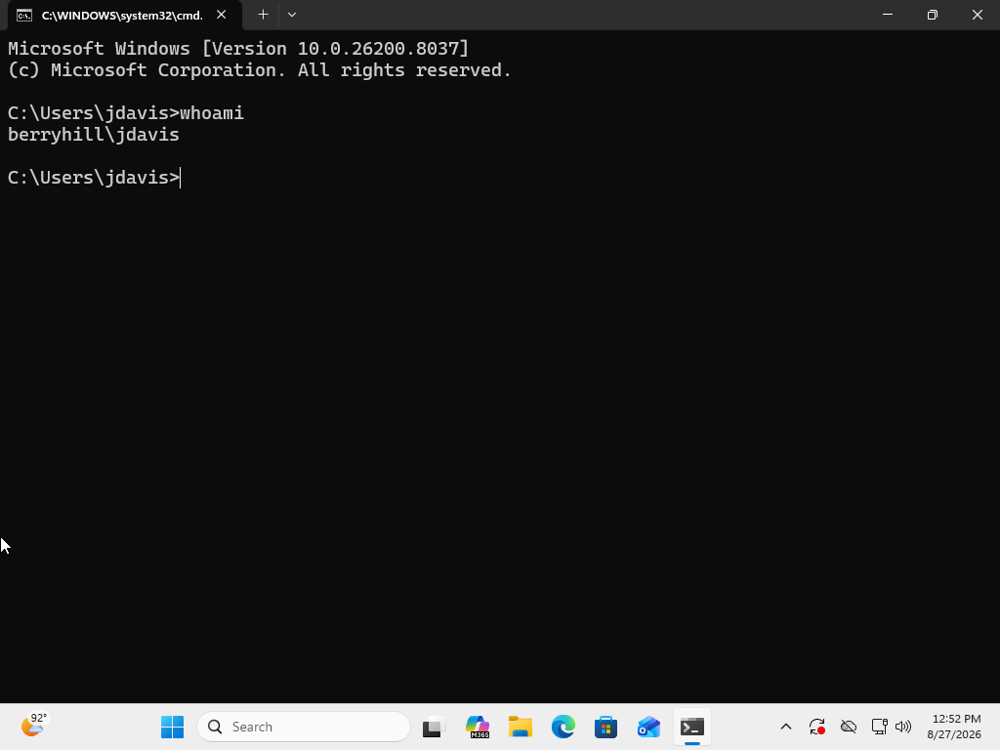

### HD-002 — Domain Account Lockout

**User:** Jordan Davis (`jdavis`)  
**Workstation:** Client01  
**Category:** Account / Authentication  
**Priority:** P3 — Normal  
**Status:** Resolved

#### Issue Reported

The user reported being unable to sign in to Client01 despite attempting to use the correct password. Windows reported that the account was currently locked out.

#### Troubleshooting Steps

1. Reproduced the sign-in issue on Client01 and observed the Windows account lockout message.
2. Opened Active Directory Users and Computers (ADUC) on DC01.
3. Located the `jdavis` domain account and opened the account properties.
4. Verified that Active Directory reported the account as currently locked out.
5. Determined that a password reset was unnecessary because the issue was an account lockout rather than an invalid or forgotten password.
6. Used the **Unlock account** option in ADUC to restore account access.
7. Returned to Client01 and successfully authenticated using the user's existing credentials.
8. Ran `whoami` to verify the authenticated domain identity.

#### Root Cause

The domain account reached the configured account lockout threshold after multiple invalid authentication attempts.

#### Resolution

Unlocked the `jdavis` domain account through Active Directory Users and Computers without resetting the user's password.

#### Verification

After the account was unlocked, the user successfully signed in to Client01 using the existing credentials.

The following command was executed:

`whoami`

The command returned:

`berryhill\jdavis`

This confirmed that domain authentication was successfully restored.

#### Evidence

**Client-side lockout message:**

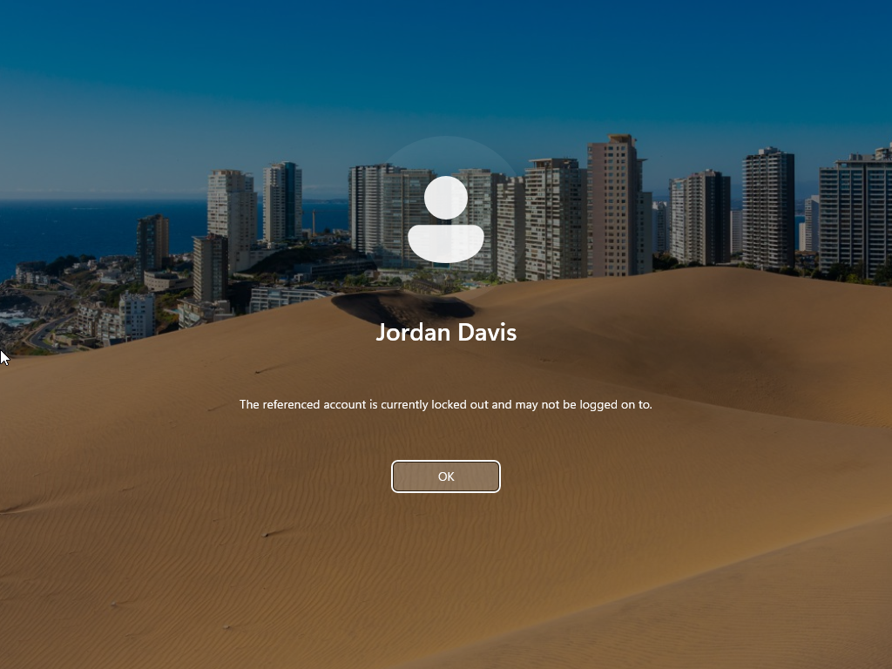

**Active Directory lockout confirmation:**

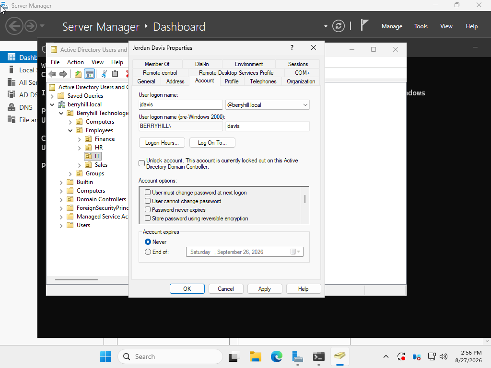

**Successful authentication after account unlock:**

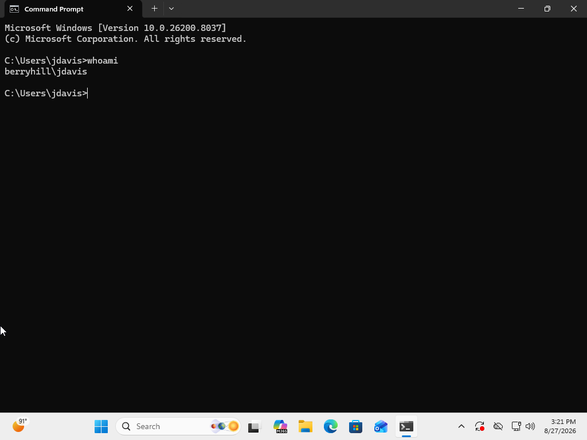

## HD-003 — User Cannot Access Shared Folder

**User:** Jordan Davis (`jdavis`)  
**Workstation:** Client01  
**Category:** Access / Permissions  
**Priority:** P3 — Normal  
**Status:** Resolved  

### Issue Reported

The user was able to access the shared folder on `\\DC01\IT-Share`, but permissions were not behaving as intended. The user should have read-only access while members of the IT-Staff group should have modify access.

### Troubleshooting Steps

1. Verified the user's current group memberships with `whoami /groups`.
2. Reviewed NTFS permissions on `C:\IT-Share`.
3. Reviewed SMB share permissions for `IT-Share`.
4. Added `Domain Users` with read-only access.
5. Confirmed `IT-Staff` retained modify access.
6. Used Advanced Security Settings and Effective Access to verify the user's resulting permissions.
7. Tested access from Client01 using the Jordan Davis account.

### Root Cause

The shared folder had inconsistent SMB and NTFS permission assignments that did not match the intended role-based access model. Standard domain users required read-only access, while members of the `IT-Staff` security group required modify access.

### Resolution

Configured group-based permissions so that `Domain Users` receive read-only access while `IT-Staff` receives modify access. Verified that Jordan Davis could open files in the share but could not save changes.

### Verification

Jordan's Effective Access showed read permissions without write, delete, or full-control permissions. A client-side test confirmed that Windows denied write access when the user attempted to save changes.

### Evidence

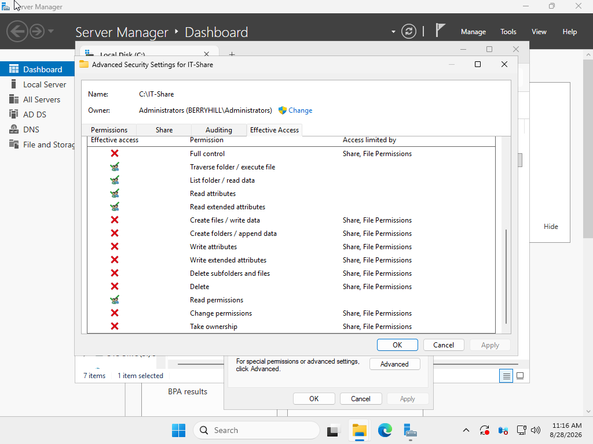

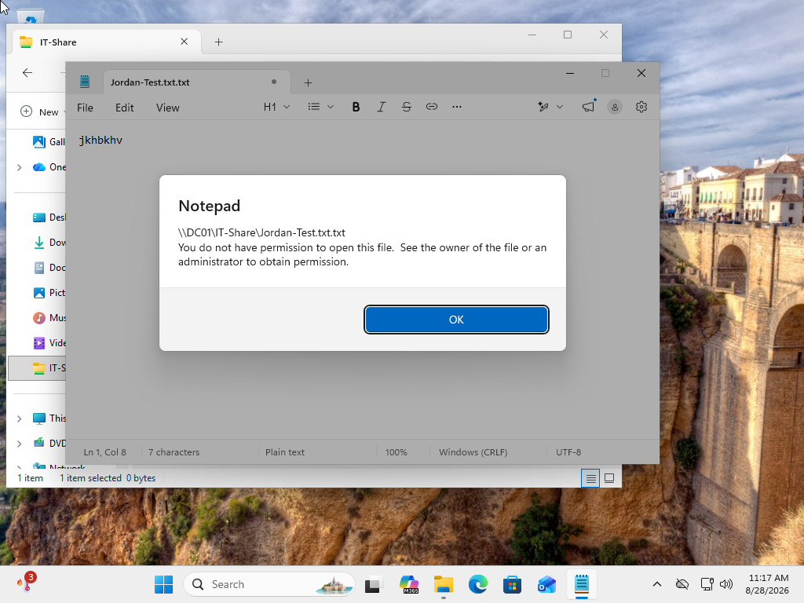

## HD-004 — Mapped Network Drive Unavailable

**User:** Jordan Davis (`jdavis`)  
**Workstation:** CLIENT01  
**Category:** File Services  
**Priority:** P3 — Normal  
**Status:** Resolved

### Issue

The user reported that the mapped network drive used to access the departmental file share was no longer available in File Explorer.

The expected mapping was:

`Z:` → `\\DC01\IT-Share`

### Troubleshooting Steps

1. Opened File Explorer and confirmed that the `Z:` mapped network drive was not present under This PC.
2. Ran `net use` and confirmed that no network drive mappings were registered for the user.
3. Tested connectivity to the domain controller using `ping DC01` and received successful replies.
4. Accessed `\\DC01\IT-Share` directly using the UNC path and confirmed that the shared folder and its contents were available.
5. Determined that the file server and SMB share were functioning and isolated the issue to the missing client-side drive mapping.
6. Recreated the mapping using:

   `net use Z: \\DC01\IT-Share /persistent:yes`

7. Ran `net use` again and confirmed that `Z:` was mapped to `\\DC01\IT-Share` with a status of `OK`.
8. Signed out and signed back in to verify that the persistent mapping was retained.

### Root Cause

The user's `Z:` drive mapping to `\\DC01\IT-Share` was absent. The underlying network connection and SMB share remained available, confirming that the issue was isolated to the client-side drive mapping rather than a file server or share outage.

### Resolution

Recreated the `Z:` network drive mapping to `\\DC01\IT-Share` using the `net use` command with the `/persistent:yes` option.

### Verification

After recreating the mapping, `net use` displayed the `Z:` drive with a status of `OK`.

The user was able to access the shared folder through the mapped drive. After signing out and signing back in, the `Z:` drive remained available, confirming that the persistent mapping was successfully restored.

### Evidence

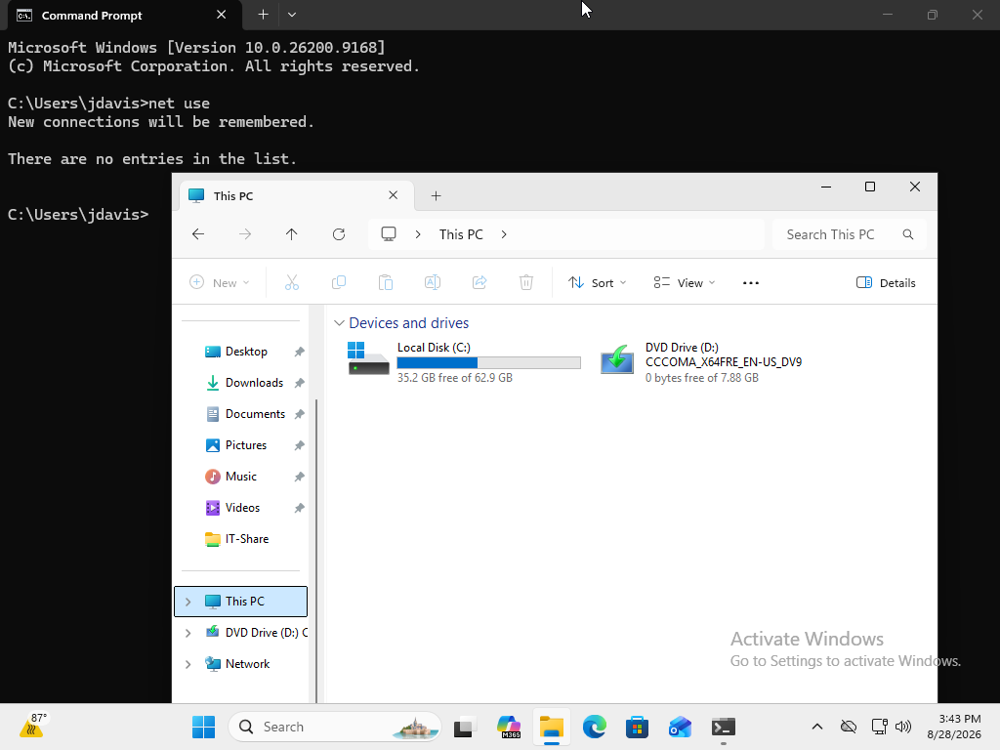

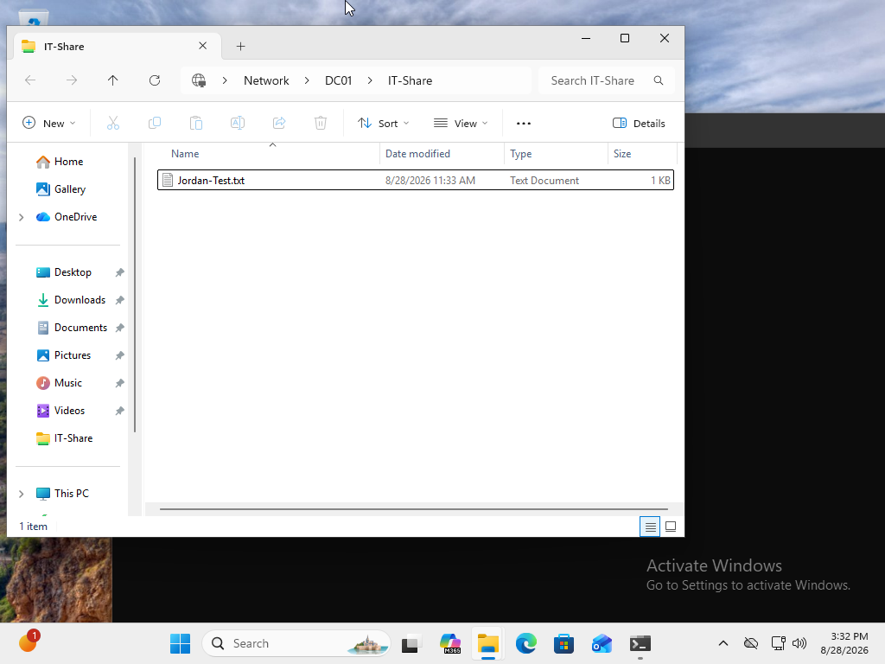

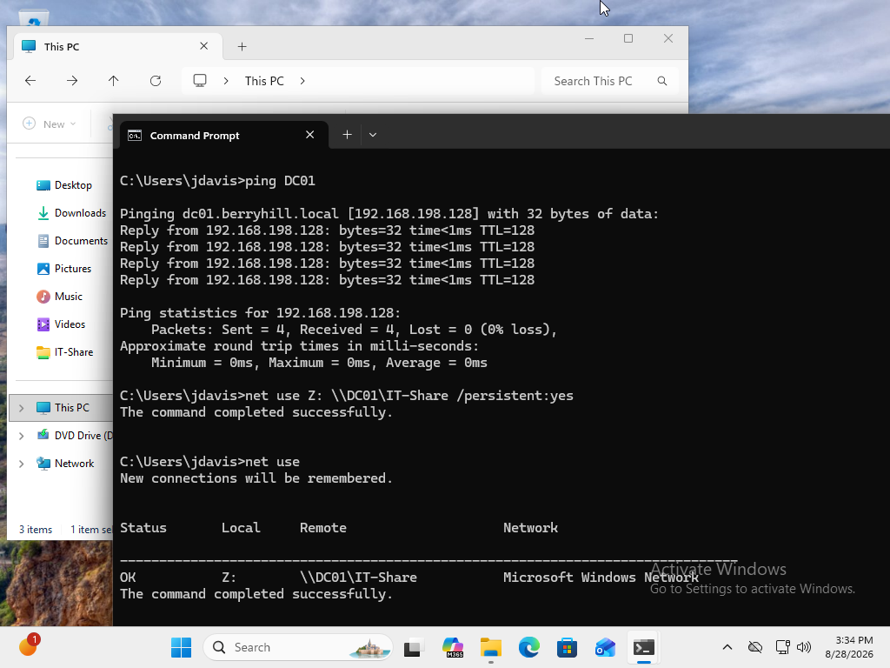

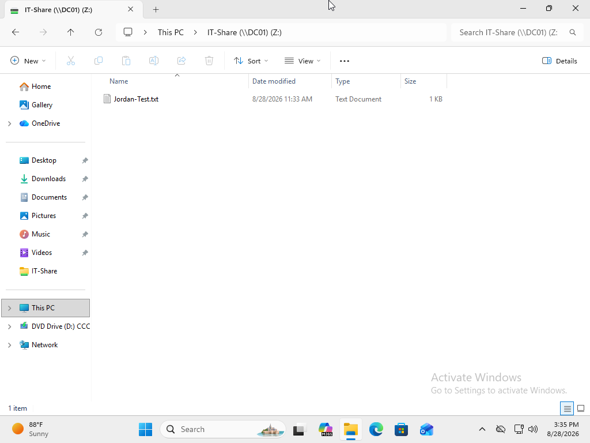

## HD-005 — User Requires Departmental Resource Access

**User:** Alex Johnson (`ajohnson`)  
**Workstation:** CLIENT01  
**Category:** Service Request  
**Priority:** P3 — Normal  
**Status:** Resolved

### Request

The user required modify access to the departmental file share:

`\\DC01\IT-Share`

The existing permission model granted standard `Domain Users` read-only access, while members of the `IT-Staff` security group received modify access.

The request was to provide Alex Johnson with the additional access required for his IT role without assigning permissions directly to his individual user account.

### Initial Access Verification

Before processing the request, Alex Johnson was authenticated as a standard domain user without `IT-Staff` membership in his current security token.

The user could access and read files within `\\DC01\IT-Share` but could not successfully modify protected content.

This confirmed that the existing read-only permissions for standard domain users were functioning as intended.

### Resolution Steps

1. Reviewed the existing access model for `\\DC01\IT-Share`.
2. Confirmed that modify access was already assigned to the `IT-Staff` Active Directory security group.
3. Added Alex Johnson (`ajohnson`) to the `IT-Staff` security group using Active Directory Users and Computers.
4. Confirmed on DC01 that Alex's Active Directory account showed membership in `IT-Staff`.
5. Signed Alex out of CLIENT01 and established a new logon session so Windows could generate a refreshed security token.
6. Verified the updated group membership using:

   `whoami /groups | findstr /I "IT-Staff"`

7. Confirmed that `BERRYHILL\IT-Staff` appeared as an enabled security group in the user's current token.
8. Accessed the departmental share and successfully modified a test file.

### Access Provisioning Method

Access was granted through membership in the existing `IT-Staff` security group rather than by assigning NTFS or SMB permissions directly to Alex Johnson.

This preserves the group-based access model and allows permissions to be administered according to job role.

### Authentication Token Validation

Although Alex's `IT-Staff` membership was present in Active Directory, the group did not initially appear in the user's existing Windows security token.

A full logoff was performed using:

`shutdown /l`

After Alex authenticated again, `whoami /groups` confirmed that `BERRYHILL\IT-Staff` was enabled in the new logon token.

### Resolution

Added Alex Johnson to the `IT-Staff` Active Directory security group and refreshed the user's Windows logon session.

The new security token included `IT-Staff` membership, allowing the permissions already assigned to the group to provide Alex with modify access to the departmental resource.

### Verification

The following were successfully verified:

- Alex Johnson was a member of `IT-Staff` in Active Directory.
- `BERRYHILL\IT-Staff` appeared as an enabled group in Alex's Windows security token.
- Alex could access `\\DC01\IT-Share`.
- Alex successfully modified and saved content within the shared resource.
- Access was provided through security group membership rather than direct user permissions.

### Evidence

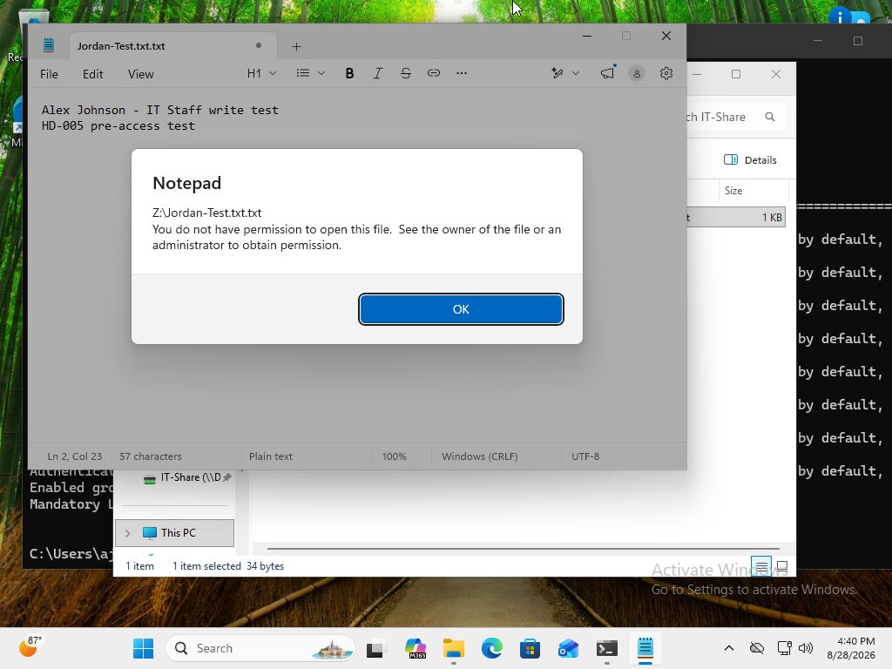

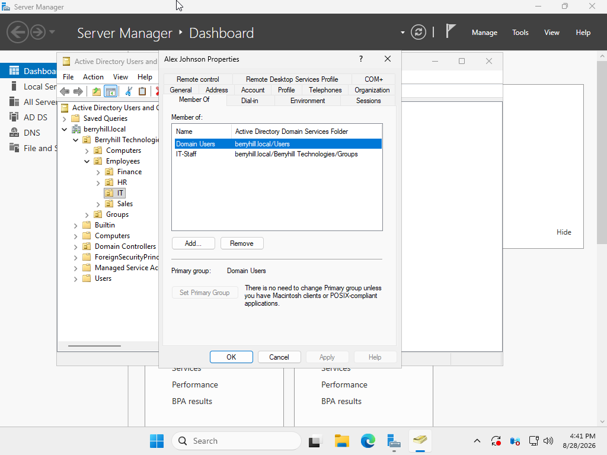

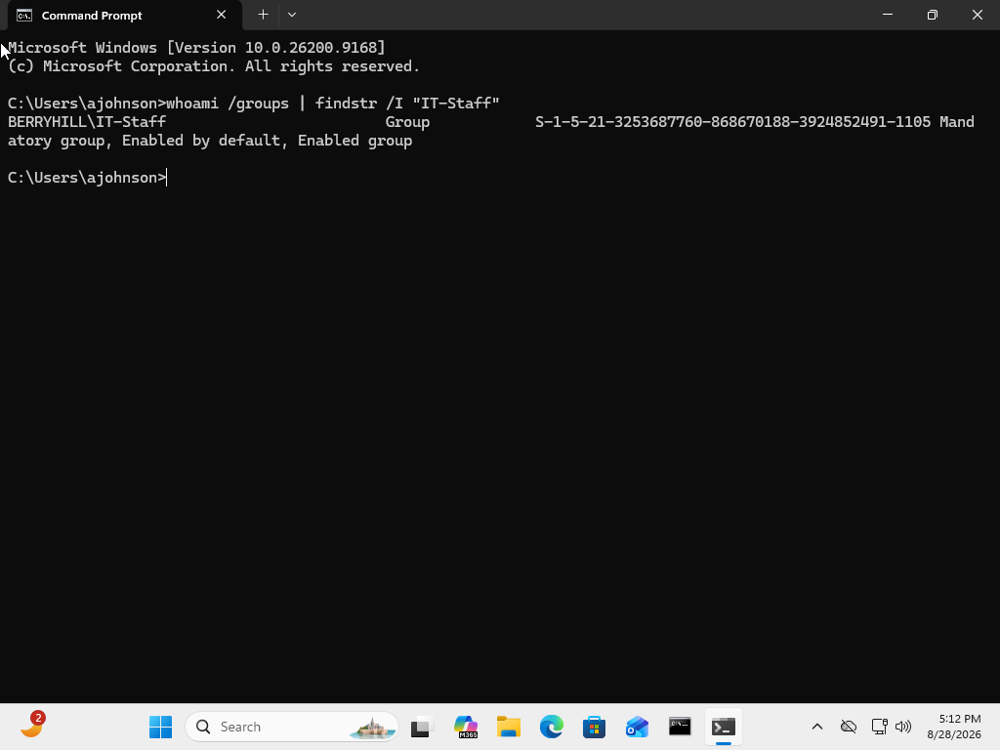

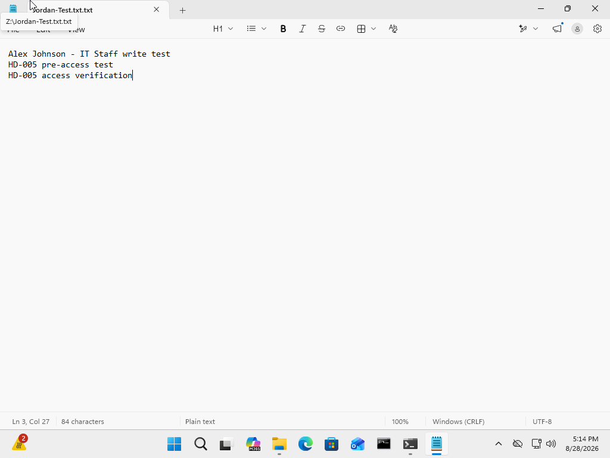

## HD-006 — Windows Application / User Profile Issue

**User:** Jordan Davis (`jdavis`)  
**Workstation:** CLIENT01  
**Category:** Application / Windows  
**Priority:** P3 — Normal  
**Status:** Resolved

### Issue

The user reported that Notepad was retaining an unwanted application configuration within their Windows profile.

The objective was to determine whether the behavior was caused by the Notepad installation on CLIENT01 or by user-specific application settings.

### Troubleshooting Steps

1. Signed into CLIENT01 as Jordan Davis and reproduced the Notepad configuration issue.
2. Confirmed that the configuration persisted when Notepad was closed and reopened.
3. Signed Jordan out of CLIENT01.
4. Signed into the same workstation as a second domain user, Alex Johnson.
5. Opened Notepad under Alex's profile and observed that the application used a different, normal configuration.
6. Determined that the issue did not affect all users on CLIENT01 and was therefore isolated to Jordan's user-specific application configuration.
7. Returned to Jordan's account and opened Windows Settings.
8. Navigated to the advanced options for Notepad and reset the application.
9. Relaunched Notepad and verified that the user-specific configuration had returned to its expected default state.

### Root Cause

The issue was isolated to user-specific Notepad application data within Jordan Davis's Windows profile.

Because Notepad behaved normally when launched by another domain user on the same workstation, the underlying application installation and workstation were determined to be functioning correctly.

### Resolution

Reset Notepad through Windows application settings for the affected user.

This cleared the user-specific application configuration without requiring a system-wide application reinstall or changes to another user's profile.

### Verification

After the reset, Notepad launched successfully under Jordan Davis's account with the expected default configuration.

A post-resolution test confirmed that the application was functioning normally.

Testing with Alex Johnson also demonstrated that the original behavior was isolated to Jordan's user-specific application configuration rather than CLIENT01 as a whole.

### Evidence

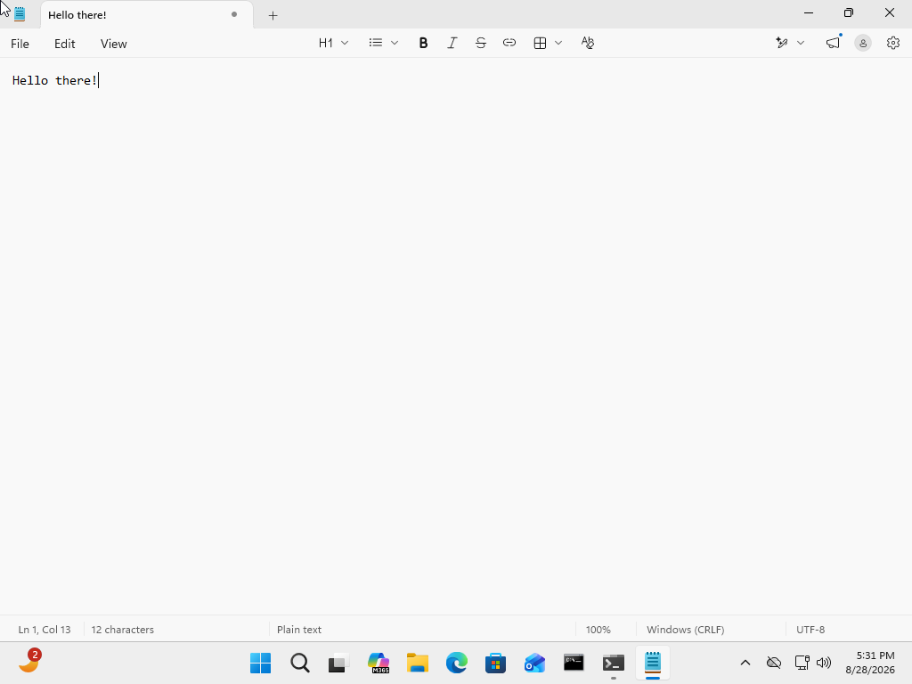

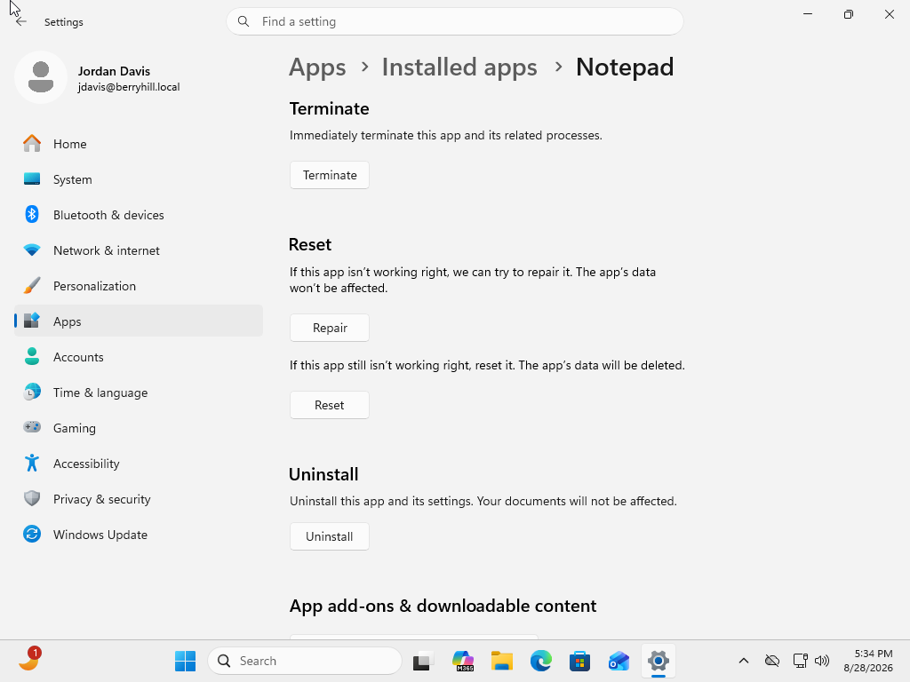

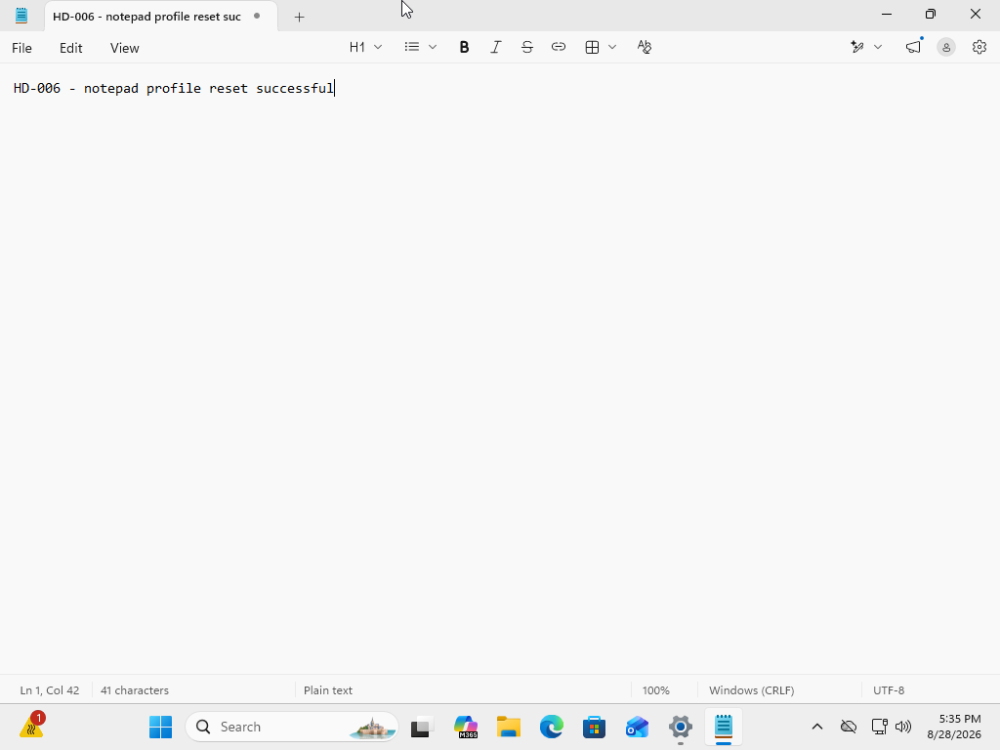

## Troubleshooting Methodology

For each support incident, I will follow a structured troubleshooting process:

1. Identify and document the user's reported problem
2. Gather information and establish the scope of the issue
3. Develop and test a probable cause
4. Implement an appropriate solution
5. Verify full system functionality
6. Document the root cause, resolution, and verification
7. Escalate the issue when it exceeds the appropriate support scope

## Tools and Technologies

- Windows 11
- Windows Server
- Active Directory Users and Computers (ADUC)
- PowerShell
- Command Prompt
- VMware Workstation
- SMB file sharing
- NTFS permissions
- Windows administrative tools

## Skills Demonstrated

- Help Desk troubleshooting
- Incident management
- Service request fulfillment
- Active Directory account administration
- Windows workstation support
- Access and permissions troubleshooting
- Technical documentation
- Root cause analysis
- Ticket prioritization
- Issue escalation
- End-user support

## Project Status

**In Progress**
