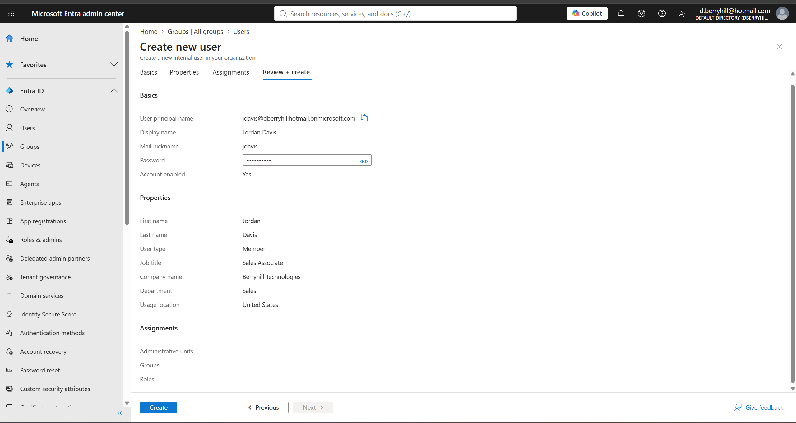
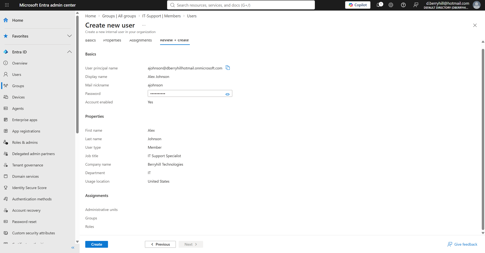
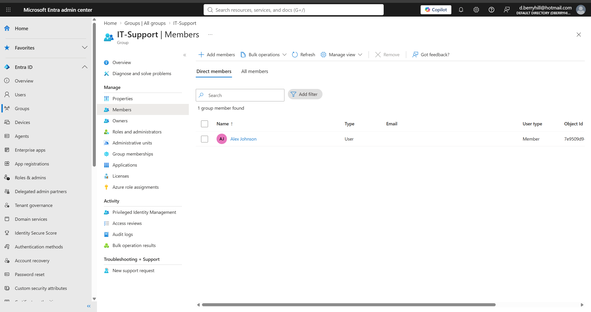
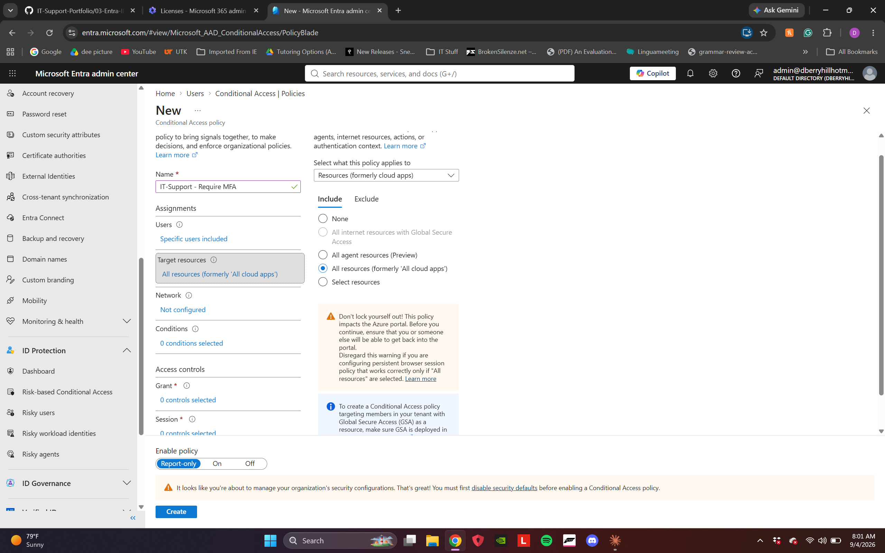
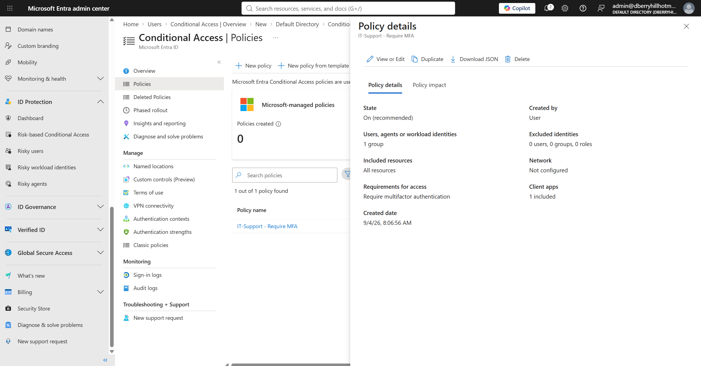
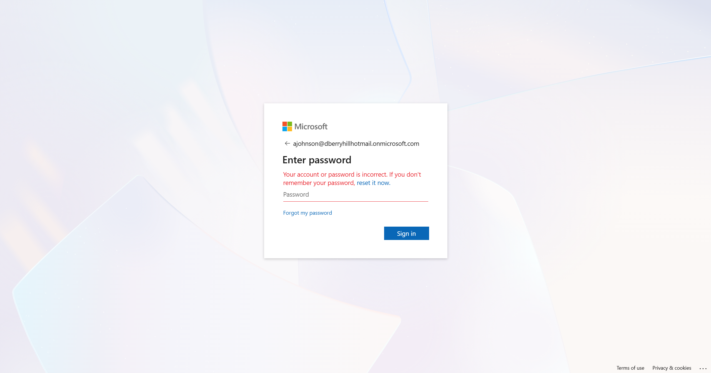
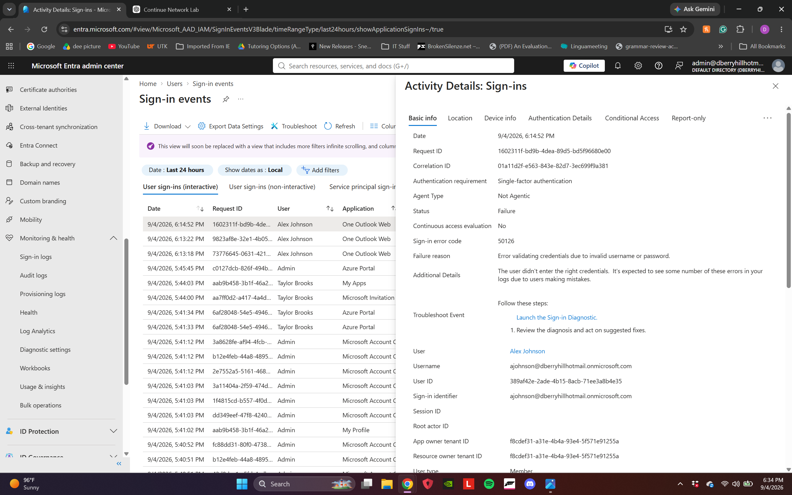
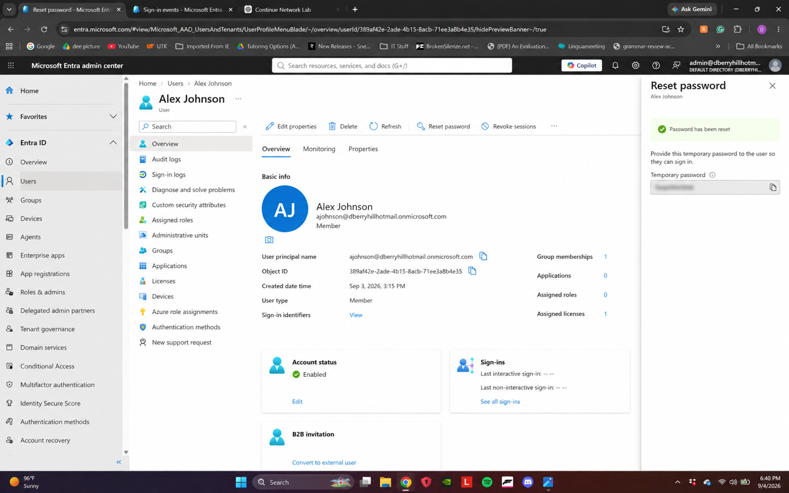
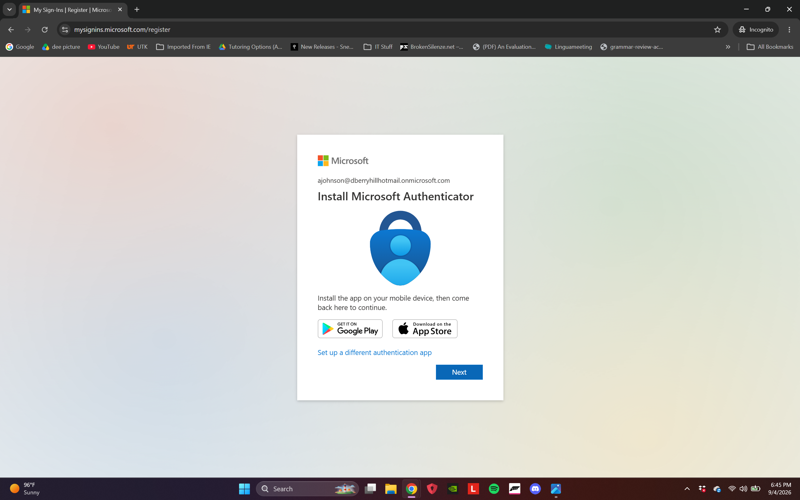
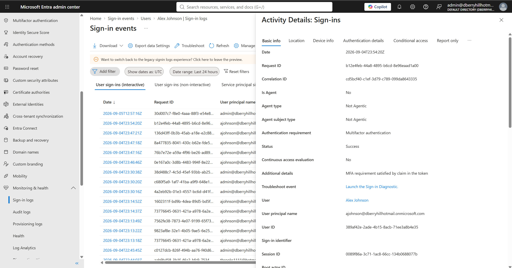

# Entra ID & Hybrid Identity Lab

## Overview

This project extends the Berryhill Technologies environment into Microsoft Entra ID, covering cloud identity provisioning, role-based access through security groups, Conditional Access-based MFA enforcement, and hybrid identity synchronization with the existing on-premises Active Directory domain.

## Lab Environment

- **Cloud Directory:** Microsoft Entra ID (Microsoft 365 tenant — dberryhillhotmail.onmicrosoft.com)
- **On-Premises Domain:** berryhill.local (Windows Server DC01, from the Active Directory Help Desk Home Lab)
- **Hypervisor:** VMware Workstation
- **Company:** Berryhill Technologies

## Objectives

- Provision cloud user identities with realistic organizational attributes
- Implement role-based access control using Entra ID security groups
- Enforce multi-factor authentication through a Conditional Access policy scoped to an elevated-access group
- Troubleshoot a real sign-in/authentication issue and document the resolution
- Establish hybrid identity by synchronizing the on-premises AD domain to Entra ID using Azure AD Connect

## User Provisioning

Two cloud identities were created to represent a standard employee and an IT staff member, consistent with the personas used in the Active Directory Help Desk Home Lab.

### Jordan Davis — Standard User

| Attribute | Value |
|---|---|
| Display Name | Jordan Davis |
| User Principal Name | jdavis@dberryhillhotmail.onmicrosoft.com |
| Job Title | Sales Associate |
| Department | Sales |
| Company Name | Berryhill Technologies |
| Usage Location | United States |

### Alex Johnson — IT Staff

| Attribute | Value |
|---|---|
| Display Name | Alex Johnson |
| User Principal Name | ajohnson@dberryhillhotmail.onmicrosoft.com |
| Job Title | IT Support Specialist |
| Department | IT |
| Company Name | Berryhill Technologies |
| Usage Location | United States |

Both accounts were created with an auto-generated temporary password and **"Require this user to change their password at next sign-in"** enabled, following standard account provisioning security practice.

### Evidence

## Security Group — Role-Based Access

An **IT-Support** security group was created to represent elevated IT access at the identity level, separate from the on-premises **IT-Staff** group used for file share permissions in the Active Directory lab. This reflects a realistic hybrid environment where cloud-native groups and on-premises-synced groups can coexist and serve different access-control purposes.

- **Group Name:** IT-Support
- **Group Type:** Security
- **Membership Type:** Assigned
- **Description:** Members with elevated IT support access to Berryhill Technologies cloud resources and applications
- **Members:** Alex Johnson

Jordan Davis was intentionally left out of this group to demonstrate that standard employees retain baseline access only.

### Evidence

## Multifactor Authentication & Conditional Access

**Status:** Completed

### Objective
Move beyond baseline Security Defaults to a scoped, group-based Conditional
Access policy — enforcing MFA specifically for the IT-Support group rather
than tenant-wide, mirroring how a real organization layers identity
protection as it grows past a single trial tenant.

### Steps
1. Disabled Security Defaults (Entra ID → Properties → Manage security
   defaults), since Security Defaults and Conditional Access policies
   cannot both govern sign-in enforcement at the same time.
2. Created a new Conditional Access policy, **IT-Support - Require MFA**:
   - **Users/groups:** IT-Support (1 group)
   - **Target resources:** All cloud apps
   - **Grant control:** Require multifactor authentication
   - **Enable policy:** On
3. Verified the policy in the Conditional Access policy list, confirming
   state, scope, and grant control matched the intended configuration.

### Evidence

*Completed policy creation form before saving — IT-Support group scoped, MFA grant control, policy enabled*

*Policy details pane confirming State: On, 1 group scoped, MFA required*

### Verification
Policy details pane confirms: State On (recommended), 1 group included,
0 users/groups/roles excluded, All resources targeted, Require
multifactor authentication as the grant control.

## Sign-In Troubleshooting Scenario

**Status:** Completed

### Scenario

Alex Johnson reported being unable to sign in to his Microsoft 365 account. A failed sign-in was intentionally generated to simulate a common Tier 1/2 identity support incident and demonstrate troubleshooting through Microsoft Entra ID.

### Initial User Error

Alex attempted to authenticate to Microsoft 365 but received the following message:

> **"Your account or password is incorrect."**

*User-facing authentication failure reproduced in an Incognito browser session.*

### Investigation — Entra ID Sign-In Logs

Rather than assuming the cause based solely on the user-facing error, the failed authentication attempt was investigated through:

**Microsoft Entra ID → Monitoring & health → Sign-in logs**

The failed interactive sign-in event for Alex Johnson was located and reviewed.

The event revealed:

- **Status:** Failure
- **Sign-in error code:** `50126`
- **Failure reason:** Error validating credentials due to invalid username or password
- **User:** Alex Johnson
- **Application:** One Outlook Web

Error `50126` confirmed that the authentication failure occurred because the supplied credentials were invalid.

*Entra ID sign-in telemetry identifying error 50126 and confirming invalid credentials as the root cause.*

### Remediation — Administrative Password Reset

After identifying the credential failure, an administrative password reset was performed for Alex Johnson through Microsoft Entra ID.

A temporary password was generated for the account so the user could regain access and establish a new password during the next authentication attempt.

*Password reset successfully completed. Temporary credential redacted from portfolio evidence.*

### MFA Enforcement

After the password issue was remediated and Alex successfully passed primary authentication, Microsoft Entra ID required registration of Microsoft Authenticator.

Alex is a member of the **IT-Support** security group, which is targeted by the previously configured **IT-Support - Require MFA** Conditional Access policy.

*Microsoft Authenticator registration triggered after successful primary authentication.*

### Verification

Following remediation and MFA configuration, the subsequent Entra ID sign-in event was reviewed to verify successful authentication.

The event confirmed:

- **User:** Alex Johnson
- **Authentication requirement:** Multifactor authentication
- **Status:** Success
- **Additional details:** MFA requirement satisfied by claim in the token

*Successful authentication verified through Entra ID sign-in logs with the MFA requirement satisfied.*

### Resolution

The incident was resolved by using Entra ID sign-in telemetry to identify invalid credentials, performing an administrative password reset, and verifying that the user could successfully authenticate while satisfying the organization's MFA requirement.

This scenario demonstrates an end-to-end cloud identity support workflow:

**User-reported sign-in failure → Sign-in log investigation → Error code analysis → Password remediation → MFA enforcement → Successful authentication verification**

## Hybrid Identity Sync — Azure AD Connect

*Status: Pending — will synchronize berryhill.local with this Entra ID tenant.*

## Tools and Technologies

- Microsoft Entra ID
- Microsoft 365 Admin Center
- Conditional Access
- Azure AD Connect *(pending)*

## Skills Demonstrated

- Cloud identity provisioning and user lifecycle administration
- Role-based access control (RBAC) through Entra ID security groups
- Organizational identity attribute management
- Conditional Access policy configuration
- Multifactor authentication (MFA) enforcement
- Microsoft Entra ID sign-in log analysis
- Authentication error code analysis and root-cause identification
- Administrative password reset and account recovery
- Post-remediation authentication verification

*Hybrid identity synchronization skills will be added after completion of the Azure AD Connect portion of the lab.*

## Project Status

**In Progress**
