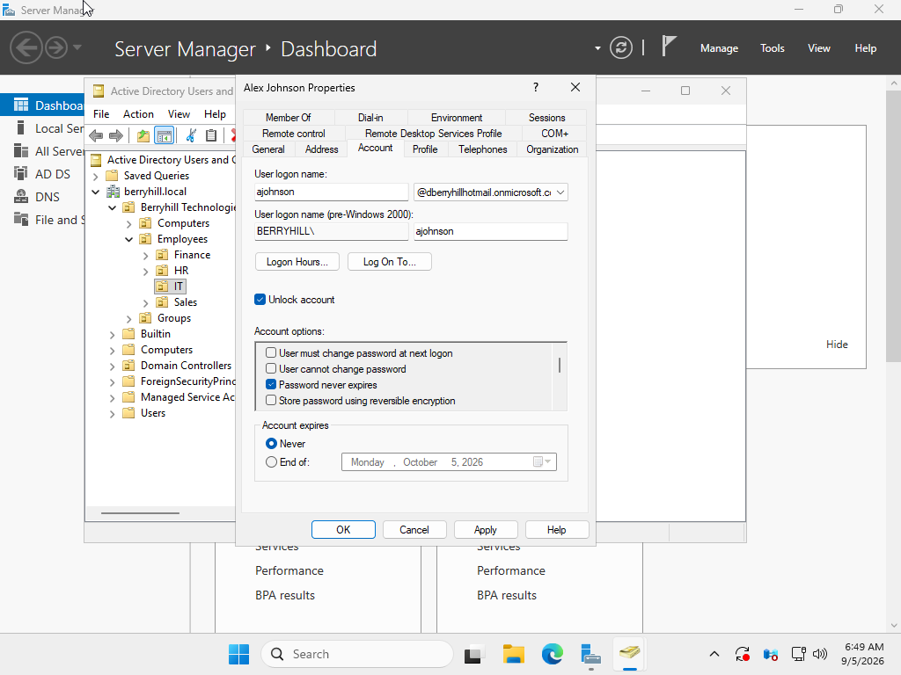
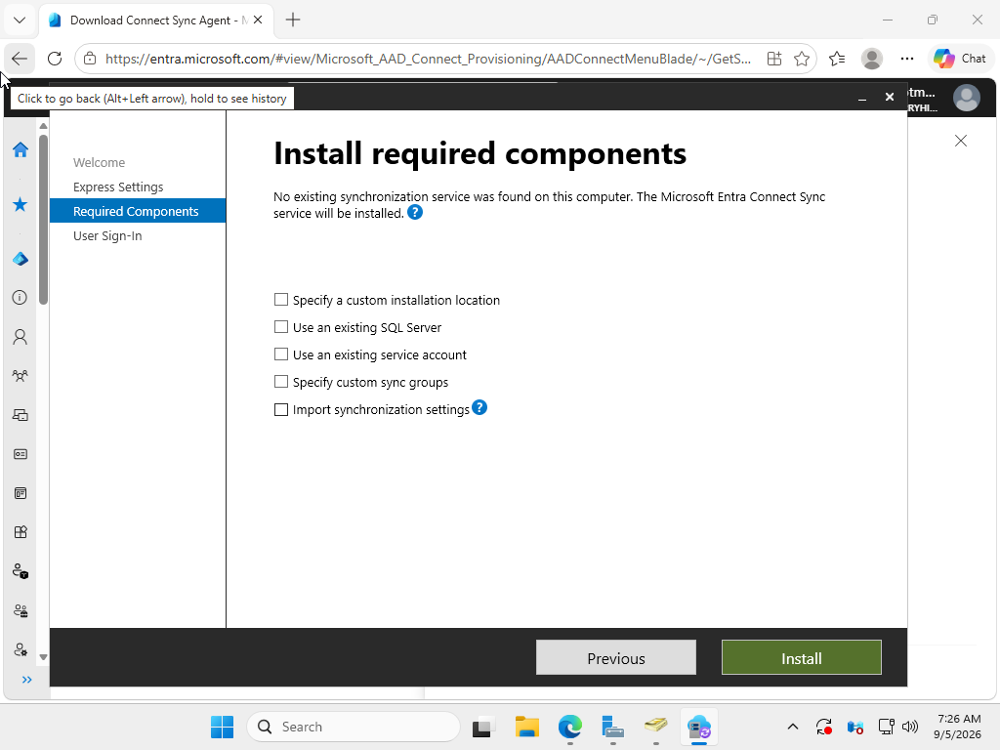
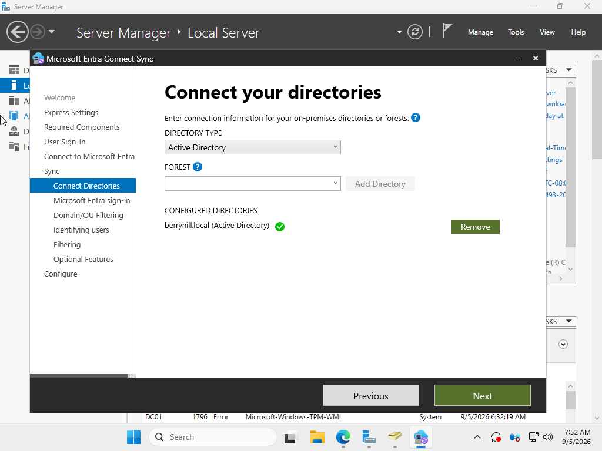
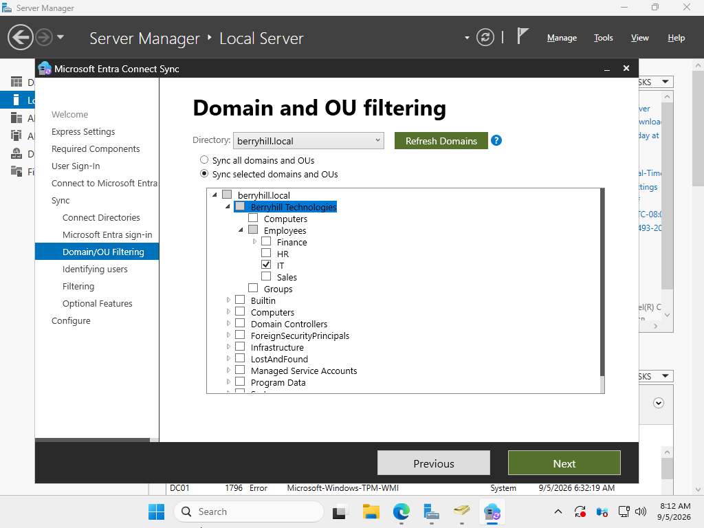
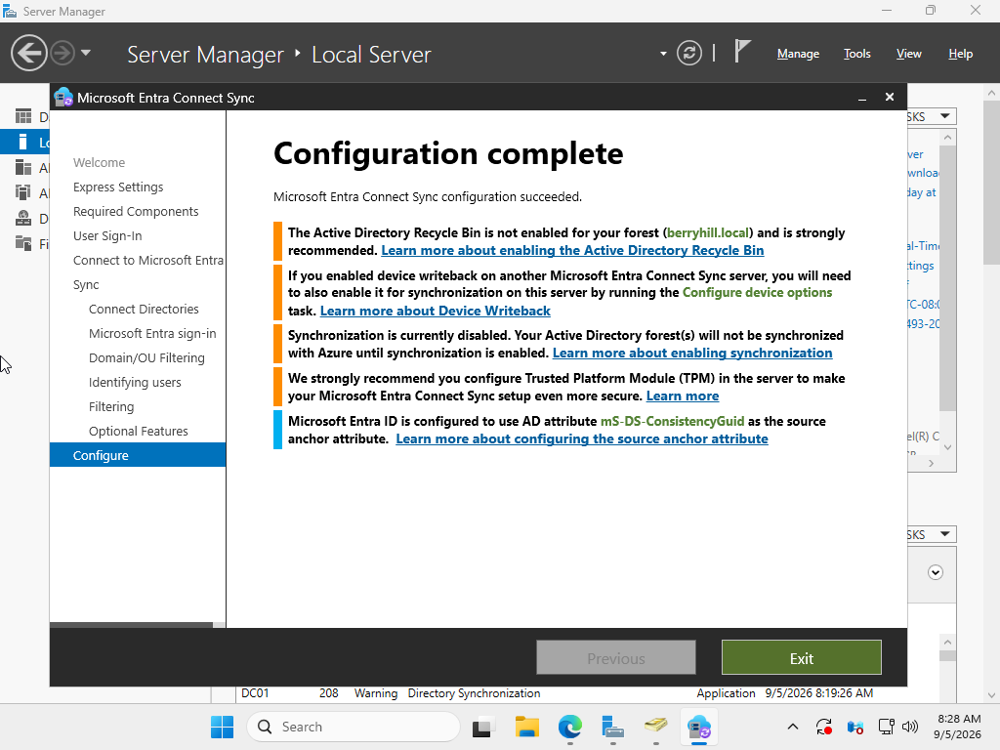
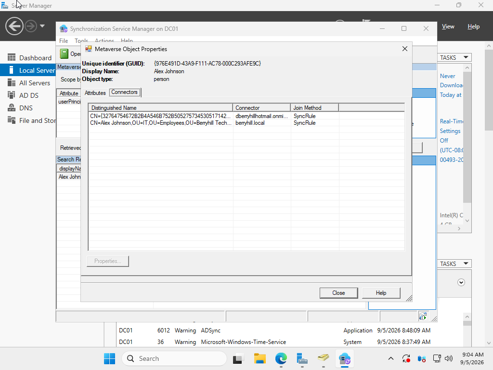
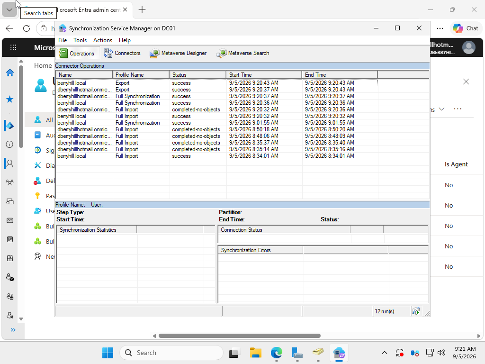
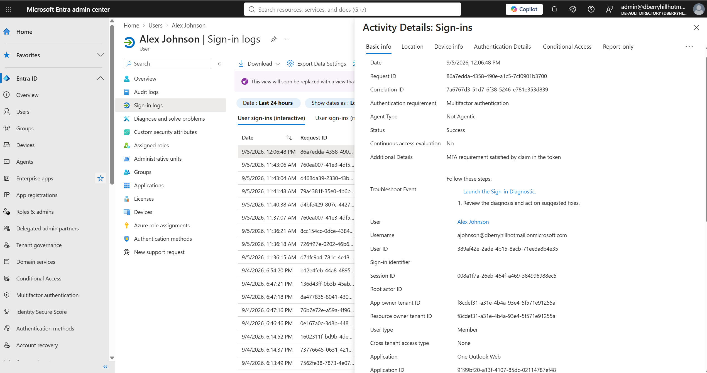

# Entra ID & Hybrid Identity Lab

## Overview

This project extends the Berryhill Technologies environment into Microsoft Entra ID, covering cloud identity provisioning, role-based access through security groups, Conditional Access-based MFA enforcement, authentication troubleshooting, and hybrid identity synchronization between the existing on-premises Active Directory domain and Microsoft Entra ID using Microsoft Entra Connect Sync and Password Hash Synchronization.

The lab builds on the Active Directory and Help Desk environments established in previous portfolio projects and demonstrates both end-user support and identity administration in a hybrid Microsoft environment.

---

## Lab Environment

- **Cloud Directory:** Microsoft Entra ID
- **Microsoft 365 Tenant:** `dberryhillhotmail.onmicrosoft.com`
- **On-Premises Domain:** `berryhill.local`
- **Domain Controller:** Windows Server `DC01`
- **Hypervisor:** VMware Workstation
- **Hybrid Identity Tool:** Microsoft Entra Connect Sync
- **Authentication Method:** Password Hash Synchronization (PHS)
- **Synchronization Scope:** IT Organizational Unit (pilot deployment)
- **Company:** Berryhill Technologies

---

## Objectives

- Provision cloud user identities with realistic organizational attributes
- Implement role-based access using Microsoft Entra ID security groups
- Enforce multifactor authentication through Conditional Access
- Troubleshoot an authentication failure using Microsoft Entra sign-in telemetry
- Perform an administrative password reset and validate restored access
- Prepare existing Active Directory identities for hybrid synchronization
- Configure Microsoft Entra Connect Sync
- Implement Password Hash Synchronization
- Limit synchronization scope using Organizational Unit filtering
- Verify successful synchronization between Active Directory and Microsoft Entra ID
- Validate authentication after hybrid identity synchronization

---

# User Provisioning

Two cloud identities were initially created to represent a standard employee and an IT staff member consistent with the personas used throughout the Active Directory and Help Desk labs.

## Jordan Davis — Standard User

| Attribute | Value |
|---|---|
| Display Name | Jordan Davis |
| User Principal Name | `jdavis@dberryhillhotmail.onmicrosoft.com` |
| Job Title | Sales Associate |
| Department | Sales |
| Company Name | Berryhill Technologies |
| Usage Location | United States |

## Alex Johnson — IT Staff

| Attribute | Value |
|---|---|
| Display Name | Alex Johnson |
| User Principal Name | `ajohnson@dberryhillhotmail.onmicrosoft.com` |
| Job Title | IT Support Specialist |
| Department | IT |
| Company Name | Berryhill Technologies |
| Usage Location | United States |

Both accounts were initially provisioned as cloud identities with temporary passwords and required password changes at first sign-in.

### Evidence

*Jordan Davis provisioned in Microsoft Entra ID as a standard employee.*

*Alex Johnson provisioned in Microsoft Entra ID as an IT Support Specialist.*

During the hybrid identity phase of the lab, corresponding on-premises Active Directory identities were prepared for synchronization with Microsoft Entra ID. This demonstrated the transition from independently created cloud identities to identities participating in a hybrid directory environment.

---

# Security Group — Role-Based Access

An `IT-Support` security group was created in Microsoft Entra ID to represent elevated IT access at the cloud identity layer.

This group is separate from the on-premises `IT-Staff` group used for file-share permissions in the Active Directory lab. This demonstrates how cloud-native and on-premises security groups can coexist and serve different access-control purposes within a hybrid environment.

- **Group Name:** IT-Support
- **Group Type:** Security
- **Membership Type:** Assigned
- **Member:** Alex Johnson

Jordan Davis was intentionally excluded from this cloud security group to represent a standard employee without elevated IT access.

### Evidence

*Alex Johnson assigned to the IT-Support security group.*

---

# Multifactor Authentication & Conditional Access

**Status:** Completed

## Objective

Move beyond baseline Security Defaults by implementing a scoped Conditional Access policy that requires MFA specifically for the `IT-Support` security group.

This demonstrates group-based identity protection rather than applying identical access requirements to every user in the tenant.

## Configuration

Security Defaults were disabled before implementing Conditional Access.

A Conditional Access policy named:

`IT-Support - Require MFA`

was configured with the following scope:

- **Users/Groups:** IT-Support
- **Target Resources:** All cloud apps/resources
- **Grant Control:** Require multifactor authentication
- **Policy State:** On

### Evidence

*Conditional Access policy configured for the IT-Support group with MFA as the required grant control.*

*Policy details confirming the policy is enabled, scoped to one group, and requires multifactor authentication.*

---

# Sign-In Troubleshooting Scenario

**Status:** Completed

## Scenario

Alex Johnson reported being unable to sign in to his Microsoft 365 account.

A failed authentication attempt was intentionally generated to simulate a common Tier 1/2 identity support incident and demonstrate troubleshooting through Microsoft Entra ID.

## Initial User Error

Alex attempted to authenticate to Microsoft 365 but received:

> "Your account or password is incorrect."

### Evidence

*User-facing authentication failure reproduced in an Incognito browser session.*

---

## Investigation — Microsoft Entra Sign-In Logs

Rather than assuming the cause based solely on the user-facing message, the failed authentication attempt was investigated through Microsoft Entra ID sign-in telemetry.

The failed interactive sign-in event revealed:

- **Status:** Failure
- **Sign-in Error Code:** `50126`
- **Failure Reason:** Error validating credentials due to invalid username or password
- **User:** Alex Johnson
- **Application:** One Outlook Web

Error `50126` confirmed that the authentication attempt failed during primary credential validation.

### Evidence

*Microsoft Entra sign-in telemetry identifying error 50126 and confirming invalid credentials as the root cause.*

---

## Remediation — Administrative Password Reset

After identifying the credential failure, an administrative password reset was performed for Alex Johnson through Microsoft Entra ID.

A temporary credential was generated so the user could regain access and establish a new password during the subsequent authentication process.

### Evidence

*Administrative password reset successfully completed. Temporary credential redacted from portfolio evidence.*

---

## MFA Enforcement

After the primary credential issue was remediated, Alex proceeded through the authentication process and was presented with Microsoft Authenticator registration as part of the account's MFA requirements.

Alex was a member of the `IT-Support` group targeted by the configured Conditional Access policy.

### Evidence

*Microsoft Authenticator registration presented after successful primary authentication.*

---

## Authentication Verification

The subsequent Microsoft Entra sign-in event was reviewed to confirm successful authentication.

The event confirmed:

- **User:** Alex Johnson
- **Authentication Requirement:** Multifactor authentication
- **Status:** Success
- **Additional Details:** MFA requirement satisfied by claim in the token

### Evidence

*Successful authentication verified through Microsoft Entra sign-in telemetry with the MFA requirement satisfied.*

## Resolution

The incident was resolved after:

1. Reproducing the reported authentication failure
2. Reviewing Microsoft Entra sign-in telemetry
3. Identifying error `50126`
4. Determining that invalid credentials caused primary authentication failure
5. Performing an administrative password reset
6. Completing the subsequent authentication process
7. Verifying successful MFA-protected authentication through Entra sign-in logs

This scenario demonstrates a complete identity-support troubleshooting workflow from user report through root-cause analysis, remediation, and post-remediation verification.

---

# Hybrid Identity — Microsoft Entra Connect Sync

**Status:** Completed

## Objective

Extend the existing `berryhill.local` Active Directory environment into Microsoft Entra ID by configuring Microsoft Entra Connect Sync.

The hybrid identity portion of the lab demonstrates synchronization of selected on-premises identities, Password Hash Synchronization, Organizational Unit filtering, synchronization monitoring, and post-sync authentication validation.

---

## On-Premises Identity Preparation

The existing Active Directory environment used the internal domain:

`berryhill.local`

Because `.local` is a non-routable namespace, Microsoft Entra Connect identified the domain suffix as not added to the Microsoft Entra tenant.

For this controlled home-lab environment, an alternative UPN suffix matching the Microsoft tenant namespace was added to Active Directory:

`dberryhillhotmail.onmicrosoft.com`

The test identities were then configured with matching UPN strings to prepare them for the hybrid identity synchronization exercise.

For example:

`ajohnson@dberryhillhotmail.onmicrosoft.com`

was configured for the on-premises Alex Johnson identity while the legacy Active Directory logon name remained available.

### Evidence

*On-premises Active Directory identity prepared for hybrid synchronization through UPN alignment.*

> **Lab Note:** The `onmicrosoft.com` namespace was used for this home-lab exercise and was still identified by the Entra Connect configuration wizard as an unmatched suffix. In a production deployment, a verified routable custom domain would normally be used for user sign-in identities.

---

# Microsoft Entra Connect Installation

Microsoft Entra Connect Sync was installed on `DC01` to establish synchronization between the on-premises Active Directory environment and Microsoft Entra ID.

Because the existing `berryhill.local` namespace is non-routable, **Custom configuration** was selected instead of Express Settings.

Custom configuration provided greater control over:

- Authentication method
- Active Directory forest connection
- Synchronization scope
- Organizational Unit filtering

### Evidence

*Custom Microsoft Entra Connect configuration selected for the hybrid identity deployment.*

---

# Active Directory Forest Connection

The `berryhill.local` Active Directory forest was connected to Microsoft Entra Connect.

During configuration, Microsoft Entra Connect was allowed to create a dedicated Active Directory connector account rather than using the Domain Administrator account as the persistent synchronization identity.

This follows the principle of avoiding unnecessary persistent use of highly privileged administrative credentials.

### Evidence

*The berryhill.local Active Directory forest successfully connected to Microsoft Entra Connect.*

---

# Password Hash Synchronization

**Password Hash Synchronization (PHS)** was selected as the authentication method.

PHS enables users to authenticate to Microsoft Entra ID using cloud-stored password hash material derived from their on-premises Active Directory credentials.

This provides cloud authentication while maintaining the on-premises Active Directory password as the source for synchronized password changes.

For this lab:

- Password Hash Synchronization was enabled
- Pass-through Authentication was not selected
- Federation was not configured
- Seamless Single Sign-On was not enabled

This kept the hybrid authentication design focused specifically on PHS.

---

# Organizational Unit Filtering

Rather than synchronizing the entire `berryhill.local` Active Directory environment, synchronization was limited to the Organizational Unit containing the pilot identities used in the lab.

The synchronization scope was configured for the:

`Berryhill Technologies → Employees → IT`

OU.

Built-in containers and unrelated Active Directory objects were excluded from the synchronization scope.

This reduced unnecessary synchronization and demonstrated controlled rollout of hybrid identity services.

### Evidence

*Microsoft Entra Connect synchronization scope limited to the IT Organizational Unit.*

> **Lab Note:** The IT OU contained the existing test identities used throughout the portfolio environment. The OU was therefore selected as the pilot synchronization scope regardless of the business-department attributes assigned to individual test users.

---

# Entra Connect Configuration

After configuring the directory connection, authentication method, identity settings, and OU filtering, Microsoft Entra Connect was prepared to synchronize the selected Active Directory identities with Microsoft Entra ID.

### Evidence

*Microsoft Entra Connect configuration prepared for the hybrid synchronization process.*

---

# Synchronization Engine Verification

Following configuration, the Microsoft Entra Connect synchronization components were reviewed to verify that the on-premises directory objects were being processed through the hybrid identity synchronization pipeline.

The connector and metaverse views provided visibility into the relationship between Active Directory objects and their corresponding Microsoft Entra identities.

### Evidence

*Hybrid identity objects reviewed through the Microsoft Entra Connect synchronization engine.*

---

# Successful Entra Export

The synchronization process was monitored to confirm that the selected identities were successfully processed and exported to Microsoft Entra ID.

A successful export provided evidence that the synchronization engine completed the outbound synchronization operation without an identified export failure.

### Evidence

*Successful export from the Microsoft Entra Connect synchronization engine.*

---

# Hybrid Authentication Verification

After synchronization, authentication was tested to validate the completed hybrid identity configuration.

The test demonstrated the relationship between:

**On-Premises Active Directory**

↓

**Microsoft Entra Connect Sync**

↓

**Password Hash Synchronization**

↓

**Microsoft Entra ID**

↓

**Conditional Access / MFA**

↓

**Microsoft 365 Authentication**

The synchronized identity successfully completed the expected authentication process, providing end-to-end validation of the hybrid identity deployment.

### Evidence

*Post-synchronization authentication verification demonstrating the completed hybrid identity authentication workflow.*

---

# Hybrid Identity Result

The completed configuration established a functional hybrid identity environment between the existing Berryhill Technologies Active Directory lab and Microsoft Entra ID.

The project demonstrated:

- On-premises Active Directory identity preparation
- UPN configuration
- Microsoft Entra Connect Sync deployment
- Active Directory forest connectivity
- Password Hash Synchronization
- Organizational Unit-based synchronization filtering
- Synchronization connector and metaverse inspection
- Successful synchronization export
- Cloud authentication
- Conditional Access and MFA
- End-to-end authentication verification

Rather than synchronizing the entire Active Directory environment, the deployment used a limited pilot scope to demonstrate controlled hybrid identity implementation.

---

# Lab Design Considerations

This project was designed as a home-lab simulation rather than a production Microsoft identity deployment.

Microsoft Entra Connect Sync was installed on `DC01` to minimize infrastructure requirements in the lab.

In a production environment, additional architectural and security considerations would normally include:

- Deploying Microsoft Entra Connect on an appropriately secured dedicated domain-joined server
- Using a verified routable custom domain for user identities
- Applying formal change-control procedures before synchronization
- Testing synchronization against a limited pilot population before broader deployment
- Monitoring synchronization health and failures
- Protecting synchronization infrastructure as highly privileged identity infrastructure
- Maintaining documented recovery and rollback procedures

These distinctions were considered while implementing the simplified home-lab architecture.

---

# Skills Demonstrated

- Microsoft Entra ID administration
- Microsoft 365 identity management
- Cloud user provisioning
- Security group administration
- Role-based access concepts
- Conditional Access
- Multifactor authentication
- Microsoft Authenticator
- Microsoft Entra sign-in log analysis
- Authentication troubleshooting
- Sign-in error code analysis
- Error `50126` diagnosis
- Administrative password resets
- Root-cause analysis
- Post-remediation verification
- Windows Server Active Directory
- User Principal Name configuration
- Microsoft Entra Connect Sync
- Hybrid identity administration
- Password Hash Synchronization
- Active Directory forest integration
- Organizational Unit filtering
- Synchronization scope management
- Connector and metaverse concepts
- Synchronization engine monitoring
- Synchronization export verification
- Hybrid authentication testing
- Technical documentation
- Tier 1/2 identity support troubleshooting

---

# Project Outcome

This lab progressed from basic Microsoft Entra ID administration into a complete identity-support and hybrid synchronization exercise.

The environment began with cloud user provisioning and group-based access control, progressed into Conditional Access and MFA enforcement, introduced a realistic authentication troubleshooting incident, and concluded with integration of the existing on-premises Active Directory environment through Microsoft Entra Connect Sync and Password Hash Synchronization.

The final environment demonstrates practical experience across both end-user identity support and foundational hybrid identity administration.
